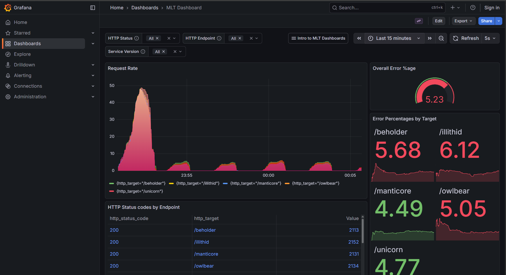
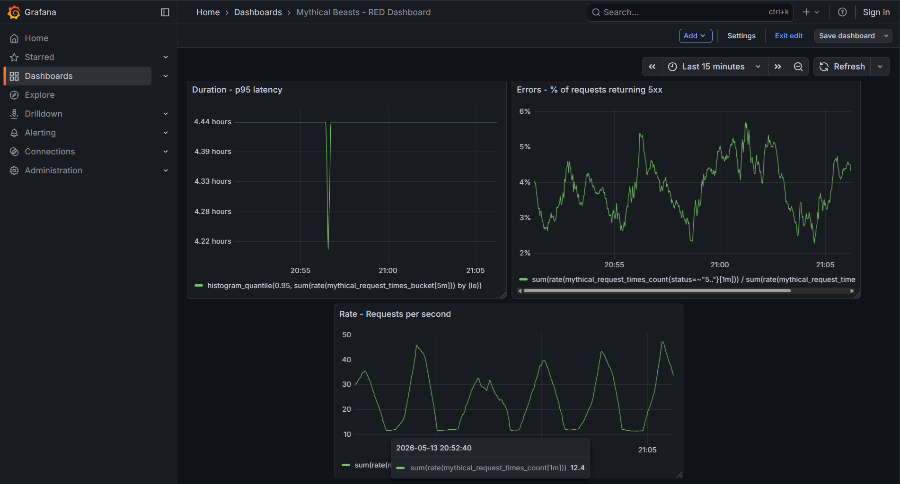
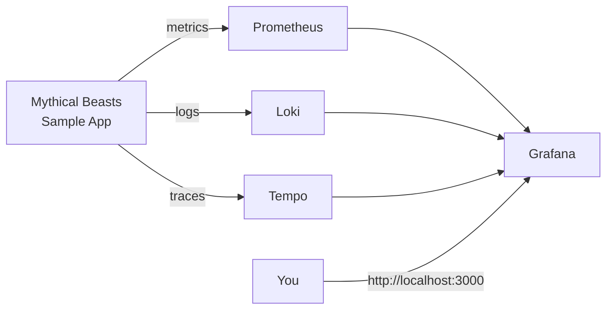

# Observability Lab — Metrics, Logs & Traces with Grafana

A self-contained observability stack you can spin up in 30 seconds with `docker compose up`. Built on top of Grafana's MLT teaching demo, extended with custom dashboards and documentation.

It demonstrates the full **three pillars of observability** — metrics, logs, and traces — wired up to a sample microservice application.



---
## Custom RED dashboard

Beyond the upstream lab dashboards, I built a custom **RED dashboard** from scratch using PromQL — Rate, Errors, and Duration are the three metrics every SRE watches first when judging a service's health.



### What each panel computes

**Rate** — total requests per second, summed across all routes and methods:
```promql
sum(rate(mythical_request_times_count[1m]))
```

**Errors** — percentage of requests returning a 5xx response:
```promql
sum(rate(mythical_request_times_count{status=~"5.."}[1m]))
  / sum(rate(mythical_request_times_count[1m])) * 100
```

**Duration** — 95th percentile latency from the request-times histogram:
```promql
histogram_quantile(0.95, sum(rate(mythical_request_times_bucket[5m])) by (le))
```

### Dashboard as code

The full dashboard is committed at [`grafana/dashboards-custom/red-dashboard.json`](grafana/dashboards-custom/red-dashboard.json), so anyone cloning the repo can re-import it without rebuilding panels by hand.

---
## What's in the stack

| Component | Role | Port |
|---|---|---|
| **Grafana** | Visualization & dashboards | 3000 |
| **Prometheus** | Metrics collection & storage | 9090 |
| **Loki** | Log aggregation | 3100 |
| **Tempo** | Distributed tracing backend | 3200 |
| **Mythical Beasts app** | Sample microservices emitting metrics, logs, and traces | 4000 |
| **Grafana Agent** | Collects telemetry from the app and forwards it | — |

## Architecture



All seven containers run on a shared Docker network. Grafana is pre-provisioned with data sources for all three telemetry backends and a set of dashboards.

---

## Quick start

**Prerequisites:** Docker Desktop running.

```bash
git clone https://github.com/Nithyareddy06/observability-lab.git
cd observability-lab
docker compose up -d
```

Wait ~60 seconds for everything to come up, then:

| What | Where |
|---|---|
| Grafana | http://localhost:3000 |
| Prometheus | http://localhost:9090 |
| Sample app | http://localhost:4000 |

Login isn't required — anonymous access is enabled.

To tear it all down:
```bash
docker compose down -v
```

---

## What I learned building this

- **The three pillars in practice.** Metrics tell you *what* is happening, logs tell you *why*, traces tell you *where* in a distributed call. Seeing all three for the same request from the same UI made the relationship click.
- **Provisioning Grafana as code.** The data sources and dashboards are defined as YAML/JSON files mounted into the container — no clicking through the UI to set things up. This is how it's done in production.
- **Docker Compose for local dev.** Seven services, one file. Easy to reset, easy to share, easy to extend.
- **Service discovery in Prometheus.** Prometheus finds the sample app via the static config in `prometheus.yml`. In a Kubernetes setup this would be replaced by service discovery via the K8s API.

---

## Repo layout

```
.
├── docker-compose.yml              # Defines all 7 services
├── grafana/
│   ├── provisioning/datasources/   # Auto-configured data sources
│   └── provisioning/dashboards/    # Auto-loaded dashboards
├── prometheus/
│   └── prometheus.yml              # Scrape config
├── loki/
├── tempo/
├── mythical-beasts/                # Sample app source
└── docs/screenshots/               # Screenshots used in this README
```

---

## Built on top of

[`grafana/intro-to-mlt`](https://github.com/grafana/intro-to-mlt) — Grafana's open-source teaching demo (Apache 2.0). I used it as the base, then added the documentation, architecture diagram, and curated screenshots for portfolio purposes.

## Next steps I'm planning

- ~~Add a custom dashboard tracking RED (Rate, Errors, Duration) for the sample app~~ ✅ done
- Wire up Alertmanager with a sample alert (e.g. error rate > 5%) and route to a webhook
- Investigate the Duration panel — p95 currently displays as hours; suggests histogram bucket boundaries need calibration
- Add a second microservice and demonstrate cross-service distributed tracing in Tempo
- Ship metrics to AWS Managed Prometheus for hybrid local-and-cloud observability